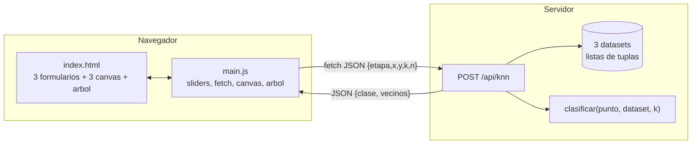
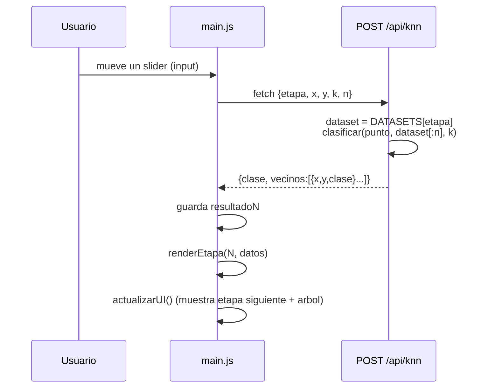

# Documento de Diseño: knn-cascade-classifier

## Overview

El sistema es un clasificador **KNN (K vecinos más cercanos)** interactivo y en cascada, con
tres etapas. El usuario ajusta parámetros mediante sliders para un punto nuevo; el frontend
consulta al backend y visualiza el resultado en un canvas, mientras un árbol de clases se va
activando o descartando según los resultados obtenidos.

Principio de diseño rector: **minimalismo, 3 archivos, un solo endpoint**. No se introducen
clases, capas de servicio, repositorios ni abstracciones adicionales. Todo el backend vive en
`app.py`; toda la lógica de interfaz vive en `static/main.js`; la estructura visual en
`templates/index.html`.

Alcance total del proyecto (3 archivos):

| Archivo | Responsabilidad |
|---|---|
| `/app.py` | Flask + los 3 datasets + función `clasificar()` + endpoint único `POST /api/knn` |
| `/static/main.js` | sliders, `fetch`, dibujo en canvas, árbol de clases |
| `/templates/index.html` | 3 formularios + 3 canvas + panel del árbol |

## Architecture

Arquitectura de dos partes, comunicación por `fetch()`, backend sin estado.



**Decisión: un único endpoint.** En lugar de tres rutas (una por etapa), se usa una sola ruta
parametrizada por `etapa`. El endpoint solo elige el dataset según `etapa` y delega en
`clasificar()`. Esto mantiene el backend en un archivo y evita duplicación.

**Decisión: backend sin estado.** El servidor no guarda nada entre solicitudes. La respuesta es
función pura del cuerpo de la petición. La "cascada" (mostrar la etapa siguiente) es un estado
que vive únicamente en el frontend (`resultado1`, `resultado2`, `resultado3`).

### Flujo de una interacción



## Components and Interfaces

### Backend — `app.py` (un solo archivo)

Contiene exactamente:

1. **Un diccionario de datasets.** Tres claves (`1`, `2`, `3`); cada valor es una lista de
   tuplas `(x, y, "clase")`.

   ```python
   DATASETS = {
       1: [(x, y, "clase"), ...],
       2: [(x, y, "clase"), ...],
       3: [(x, y, "clase"), ...],
   }
   ```

2. **Una función `clasificar(punto, dataset, k)`** — la única lógica de negocio. Calcula la
   distancia Euclidiana de `punto` a cada elemento de `dataset`, ordena por distancia, toma los
   `k` más cercanos, hace la votación por mayoría y devuelve `(clase, vecinos)`.

   - Distancia Euclidiana: `sqrt((x1-x2)^2 + (y1-y2)^2)`.
   - Votación por mayoría: la clase más frecuente entre los `k` vecinos.
   - Desempate: si dos o más clases empatan en cantidad de votos, gana la clase del **vecino más
     cercano** entre las empatadas (el de menor distancia).
   - `k` se ajusta (clamp) a `min(k, len(dataset))` para no pedir más vecinos de los disponibles.

   ```python
   def clasificar(punto, dataset, k):
       # distancias -> [(dist, x, y, clase), ...]
       # ordenar por dist ascendente
       # k_efectivo = min(k, len(dataset)); si dataset vacio -> clase None, vecinos []
       # vecinos = primeros k_efectivo
       # conteo de clases entre vecinos
       # clase = mayoria; empate -> clase del vecino de menor distancia entre las empatadas
       # return clase, [{"x":..,"y":..,"clase":..}, ...]
   ```

3. **Un endpoint `POST /api/knn`** — sin lógica de negocio propia; solo orquesta.

**Contrato del endpoint**

- Método/ruta: `POST /api/knn`
- Cuerpo (JSON):

  | Campo | Tipo | Descripción |
  |---|---|---|
  | `etapa` | `int` (1, 2 o 3) | Selecciona el dataset |
  | `x` | `number` | Coordenada X del punto nuevo |
  | `y` | `number` | Coordenada Y del punto nuevo |
  | `k` | `int` | Número de vecinos solicitados |
  | `n` | `int` | Usar solo los **primeros N** puntos del dataset |

- Respuesta (JSON):

  ```json
  {
    "clase": "nombre_de_clase",
    "vecinos": [{"x": 1.0, "y": 2.0, "clase": "a"}, ...]
  }
  ```

- Lógica del endpoint (deliberadamente mínima):

  ```python
  @app.route("/api/knn", methods=["POST"])
  def api_knn():
      body = request.get_json()
      dataset = DATASETS[body["etapa"]][: body["n"]]      # primeros N (Req 4.3)
      clase, vecinos = clasificar((body["x"], body["y"]), dataset, body["k"])
      return jsonify({"clase": clase, "vecinos": vecinos})
  ```

- `etapa` inválida (fuera de 1–3): responder con error (HTTP 400) y un `{"error": ...}`.

### Frontend — `static/main.js`

Sin clases; solo variables y funciones al nivel del módulo.

- **Tres variables de estado simples:**
  ```js
  let resultado1 = null;
  let resultado2 = null;
  let resultado3 = null;
  ```

- **`renderEtapa(numEtapa, datos)`** — función reutilizada por las 3 secciones. Dibuja en el
  canvas de la etapa `numEtapa`: los puntos del dataset, el punto nuevo, y las líneas del punto
  nuevo a cada vecino devuelto.

- **`actualizarUI()`** — según `resultado1` / `resultado2`, muestra u oculta los formularios de
  la etapa siguiente y actualiza el árbol de clases (agrega/quita `.activo` / `.descartado`).
  - `resultado1 === null` → etapa 2 y 3 ocultas.
  - `resultado1 !== null` → etapa 2 visible.
  - `resultado2 !== null` → etapa 3 visible.

- **Listeners `input`** en los sliders de cada etapa → arman el cuerpo `{etapa, x, y, k, n}`,
  hacen `fetch("/api/knn", …)`, guardan la respuesta en el `resultadoN` correspondiente, y
  luego llaman a `renderEtapa(N, datos)` y `actualizarUI()`.

### Árbol de clases — HTML/CSS + JS

`div`s anidados en `index.html`, estilizados con CSS. Sin canvas ni SVG. `main.js` solo agrega
o quita las clases `.activo` y `.descartado` sobre esos `div`s desde `actualizarUI()`.

### Estructura — `templates/index.html`

Contiene las 3 secciones de etapa (cada una con su formulario de sliders y su `<canvas>`) y el
panel del árbol de clases. Carga `static/main.js`.

## Data Models

Modelos de datos mínimos, sin ORM ni clases.

**Punto de dataset (backend, tupla):**
```
(x: float, y: float, clase: str)
```

**Diccionario de datasets (backend):**
```
DATASETS: dict[int, list[tuple[float, float, str]]]   # claves 1, 2, 3
```

**Petición (JSON):**
```
{ etapa: int(1..3), x: number, y: number, k: int, n: int }
```

**Respuesta (JSON):**
```
{ clase: str | null, vecinos: [ { x: number, y: number, clase: str } ] }
```

**Estado del frontend (variables sueltas):**
```
resultado1, resultado2, resultado3 : (Respuesta | null)
```

## Correctness Properties

*Una propiedad es una característica o comportamiento que debe cumplirse en todas las ejecuciones
válidas del sistema: es una afirmación formal sobre lo que el sistema debe hacer. Las propiedades
sirven de puente entre las especificaciones legibles por humanos y las garantías de corrección
verificables por máquina.*

Las propiedades siguientes se aplican a la lógica pura del backend (`clasificar()` y el endpoint
como función del cuerpo). La renderización del canvas y el árbol son de interfaz y se cubren con
tests basados en ejemplos (ver Testing Strategy), no con propiedades.

### Property 1: Clasificación correcta (k-más-cercanos euclidianos + mayoría)

*Para todo* punto, dataset no vacío y `k`, los vecinos devueltos son exactamente los
`min(k, len(dataset))` puntos de menor distancia Euclidiana al punto, y la `clase` devuelta es la
clase mayoritaria entre esos vecinos (y por tanto una clase presente en el dataset).

**Validates: Requirements 3.1, 3.2, 3.3**

### Property 2: Los vecinos pertenecen a los primeros N puntos

*Para todo* dataset, todo `N` y toda petición, cada vecino devuelto es uno de los primeros `N`
puntos del dataset seleccionado (nunca un punto fuera de ese subconjunto).

**Validates: Requirements 4.3**

### Property 3: Cantidad de vecinos = min(K, N)

*Para todo* `K` y `N`, la cantidad de vecinos devueltos es exactamente `min(K, N_efectivo)`,
donde `N_efectivo` es el número de puntos disponibles tras aplicar `N`; nunca excede los puntos
disponibles (ajuste/clamp de K).

**Validates: Requirements 5.2, 5.3**

### Property 4: Desempate por vecino más cercano

*Para toda* clasificación en la que el máximo de votos sea compartido por dos o más clases, la
`clase` elegida es la clase empatada cuyo vecino más cercano (de menor distancia) es el más
próximo al punto.

**Validates: Requirements 3.4**

### Property 5: Ausencia de estado (idempotencia entre solicitudes)

*Para toda* secuencia de solicitudes, emitir la misma petición dos veces (aunque haya otras
peticiones intercaladas) produce respuestas idénticas: la respuesta es función pura del cuerpo y
no depende de solicitudes previas.

**Validates: Requirements 3.5, 8.1**

## Error Handling

- **`etapa` inválida** (no está en 1–3): el endpoint responde HTTP 400 con `{"error": "..."}`.
- **`n` fuera de rango**: el troceado `dataset[:n]` de Python tolera `n` mayor que el tamaño
  (devuelve todo) y `n <= 0` (devuelve lista vacía). Con dataset vacío, `clasificar` devuelve
  `clase = null` y `vecinos = []`.
- **`k` mayor que los puntos disponibles**: se ajusta a `min(k, len(dataset))` (Property 3); no
  es un error.
- **JSON ausente o campos faltantes**: el endpoint responde HTTP 400 con `{"error": "..."}`.
- **Frontend**: si `fetch` falla o la respuesta no es OK, no se actualiza `resultadoN` y se deja
  la interfaz en el estado anterior (sin romper la cascada).

Se mantiene el manejo de errores dentro de `app.py`; no se agregan módulos ni middleware.

## Testing Strategy

**Enfoque dual:**
- **Tests unitarios / de ejemplo:** casos concretos, selección de dataset por etapa, condiciones
  de borde, comportamiento de la interfaz (canvas y árbol).
- **Tests de propiedades (PBT):** propiedades universales de `clasificar()` y del endpoint sobre
  un amplio espacio de entradas.

**Aplicabilidad de PBT.** El núcleo (`clasificar()` — distancia euclidiana + votación) es una
función pura con comportamiento que varía significativamente con la entrada: es el caso ideal
para PBT. En cambio, `renderEtapa` (dibujo en canvas), la cascada de formularios y el árbol de
clases (`.activo` / `.descartado`) son de interfaz y **no** se prueban con PBT; se cubren con
tests basados en ejemplos / DOM.

**Configuración de PBT:**
- Biblioteca sugerida: **Hypothesis** (Python) para la lógica de `app.py`. No implementar PBT
  desde cero.
- Mínimo **100 iteraciones** por test de propiedad.
- Cada test de propiedad se etiqueta con un comentario referenciando la propiedad de diseño.
- Formato de etiqueta: **Feature: knn-cascade-classifier, Property {número}: {texto de la propiedad}**

**Cobertura de propiedades (backend):**
- Property 1 → un test de propiedad (comparación model-based: ordenar por distancia como
  referencia; verificar que los vecinos son los k más cercanos y la clase es la mayoría).
- Property 2 → un test de propiedad (los vecinos son subconjunto de `dataset[:n]`).
- Property 3 → un test de propiedad (cantidad de vecinos = `min(K, N_efectivo)`).
- Property 4 → un test de propiedad usando generadores que fuerzan empates de conteo de votos.
- Property 5 → un test de propiedad (misma petición repetida/intercalada ⇒ respuesta idéntica).

**Tests de ejemplo / unitarios:**
- Selección de dataset: un caso por `etapa` (1, 2, 3) y un caso de `etapa` inválida (HTTP 400).
- Bordes: `n <= 0` (vecinos vacíos, clase null), `n` mayor que el dataset, `k` mayor que N.
- Interfaz (DOM): estado `null/null` oculta etapas 2 y 3; con `resultado1` se muestra etapa 2;
  con `resultado1` + `resultado2` se muestra etapa 3.
- Interfaz (canvas): `renderEtapa` emite las operaciones de dibujo esperadas (puntos, punto
  nuevo, líneas a vecinos) para un resultado dado.
- Árbol: se aplican `.activo` / `.descartado` según el estado de resultados.

## Mapeo a Requisitos

Trazabilidad entre los criterios de aceptación reales de `requirements.md` y los elementos de
este diseño que los cubren:

| Req | Criterio de aceptación | Cubierto por |
|---|---|---|
| 1.1 | Ejecutar Etapa_1 (Técnico / No técnico) | Endpoint (`etapa=1`); `clasificar()` |
| 1.2 | WHEN Técnico → ejecutar Etapa_2 | `actualizarUI()` (muestra etapa 2 según `resultado1`) |
| 1.3 | IF No técnico → finalizar | `actualizarUI()` (no muestra etapas siguientes) |
| 1.4 | WHEN Infraestructura/Sistemas → ejecutar Etapa_3 | `actualizarUI()` (muestra etapa 3 según `resultado2`) |
| 1.5 | IF Desarrollo/Datos → finalizar | `actualizarUI()` (no muestra etapa 3) |
| 1.6 | WHEN Etapa_3 finaliza → mostrar resultado | `renderEtapa(3, …)`; `actualizarUI()` |
| 2.1–2.6 | Rangos de las 6 variables por etapa | Sliders en `index.html`; `min`/`max` de cada control |
| 2.7 | Clamping de valores fuera de rango | Sliders (rango acotado); validación en `main.js` |
| 3.1 | Distancia Euclidiana | Property 1; `clasificar()` |
| 3.2 | Seleccionar los K menores | Property 1; `clasificar()` |
| 3.3 | Votación por mayoría | Property 1; `clasificar()` |
| 3.4 | Desempate por vecino más cercano | Property 4; `clasificar()` |
| 3.5 | Sin estado compartido | Property 5; endpoint sin estado |
| 4.1 | Dataset_Base de 20 puntos | `DATASETS` en `app.py` |
| 4.2 | Control N (1–20) | Slider `n` en `index.html` |
| 4.3 | Usar los primeros N puntos | Property 2; `dataset[:n]` |
| 5.1 | Control K (1–N) | Slider `k` en `index.html` |
| 5.2 | WHEN N < K → ajustar K a N | Property 3; `min(k, len(dataset))` |
| 5.3 | Mantener K en 1–N | Property 3; `min(k, len(dataset))`; slider `k` |
| 6.1–6.5 | Panel de árbol de clases | Árbol HTML/CSS; `actualizarUI()` (`.activo`/`.descartado`) |
| 7.1 | Puntos coloreados por clase | `renderEtapa()` (canvas) |
| 7.2 | Punto nuevo | `renderEtapa()` (canvas) |
| 7.3 | Líneas a los K vecinos | `renderEtapa()` (canvas) |
| 8.1 | Cálculos independientes sin interferencia | Property 5; endpoint sin estado |
| 9.1–9.3 | Interfaz minimalista + tema claro/oscuro | `index.html` + CSS; alternador de tema en `main.js` |
| 10.1 | Recalcular sin reenviar formulario | Listeners `input` en sliders → `fetch` |
| 10.2 | Re-render de Visualización_2D y Panel_Árbol | `renderEtapa()` + `actualizarUI()` |
